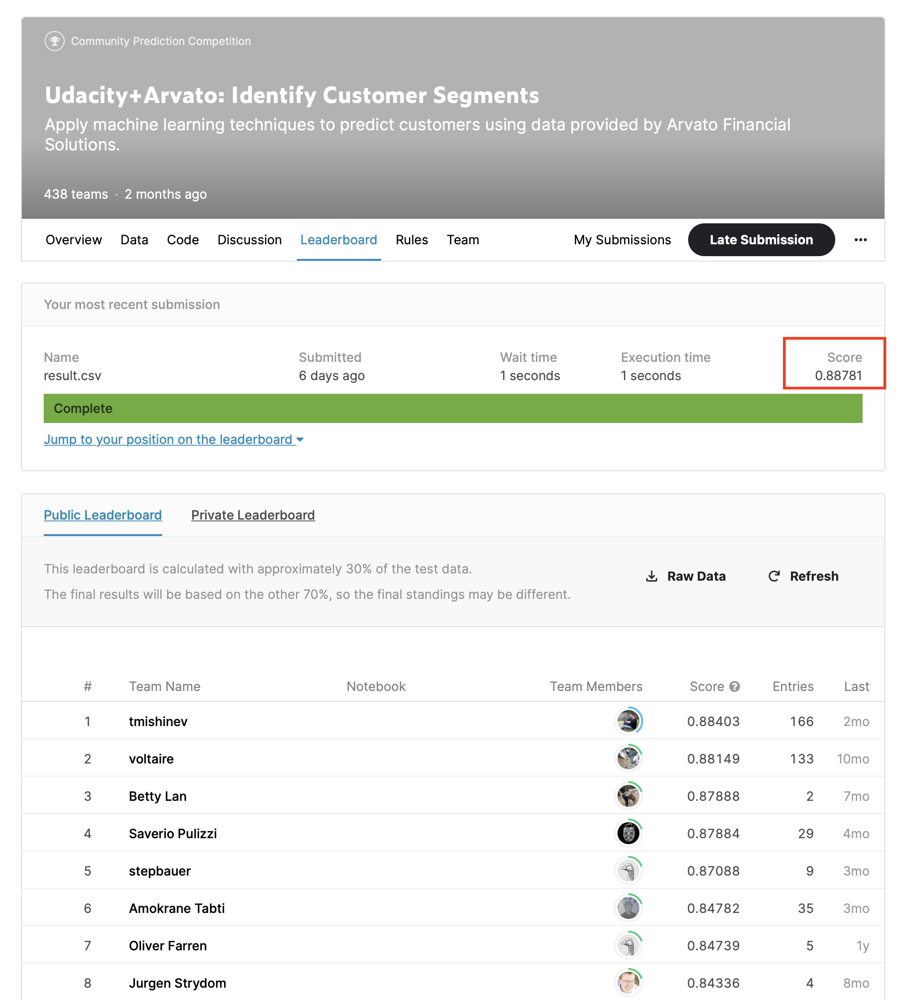

# Customer Conversion Prediction ML Project 

This project aims to understand the customer characteristics of a mail order company to improve their targeted marketing campaigns. We leveraged datasets supplied by Arvato Analytics, to understand the key characteristics of the customer base and built a supervised model to predict the likelihood of a customer conversion. The final model was submitted in a Kaggle competition and evaluated based on the Receiver Operating Characteristics Area Under Curve score. The model has a score of 0.8878 ranking 1st among 438 participants.

Due to confidentiality the datasets are not provided publicly. 

