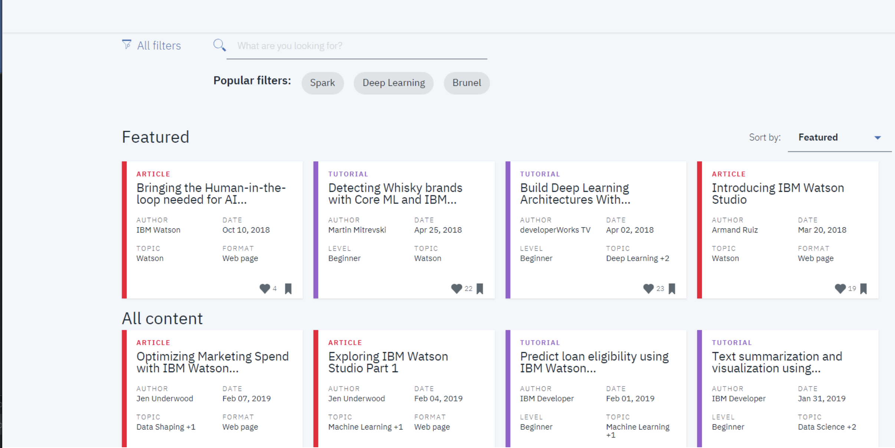

# Project: Recommendations Engines with IBM

This project was designed to analyze the interactions that users have with articles on the IBM Watson Studio platform, and make recommendations to them about new articles.

### Table of Contents

1. [Installation](#installation)
2. [Project Motivation](#motivation)
3. [Files Descriptions](#files)

## Installation 

All libraries are available in Anaconda distribution of Python. The used libraries are:

- pandas
- numpy
- plotly
- matplotlib
- nltk
- sklearn
- re
- time

The code should run using Python versions 3.*.

## Project Motivation
The recommender system can make recommendations in a number of ways:
1. Collaborative Filtering
> - Takes into account the similarity of users and recommends the most popular articles read by similar users
2. Rank Based Recommendations
> - Recommends the highest ranked articles starting with the most highly ranked 
3. Content Based Filtering
> - Produces recommendations based on similarity to material the user has interacted with previously. Utilizes Natural Language Processing (NLP) methodology to analyse and rank articles by similarity.
4. SVD - Matrix Factorization Recommendations
> - Utilises matrix operations to predict the ranking (or in this case the boolean interaction variable)  

## Files Description 

- data/articles_community.csv: All the articles available in IBM Watson platform
- data/user-item-interactions.csv: User - articles interactions
- data/user_item_matrix.p: a matrix with user ids as rows and article ids on the columns with 1 values where a user interacted with an article and a 0 otherwise
- Recommendations_with_IBM.ipynb: Jupyter notebook which includes the recommendation system
- Recommendations_with_IBM.html: HTML version of the code
- project_tests.py: Unit tests
- top_5.p, top_10.p, top_20.p: Files needed for the unit tests

